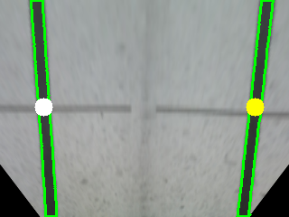
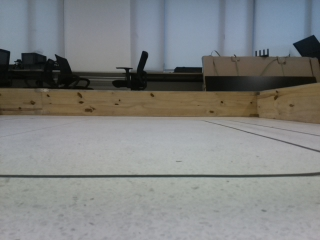

# Mobile Robot Navigation and Control Final Lab Report
# Yuxuan Deng, Zihan Song
## Github repository link : https://github.com/Facecce/EE346_final.git
## Introduce
### In the previous experiment class, we completed the mapping and navigation of the turnlebot3, calibrated the raspberry camera, and completed the line following and aruco code recognition according to the steps of the experiment class. In the last experiment class, we need to integrate on TurtleBot3 the functions that have been developed in all the previous labs throughout the semester making the turtlebot automatically detect and follow the line, find points and identify aruco. The competition lasts five minutes. Within the stated time, starting from P1, complete one or more of the three tasks, and then return to P1 for one lap. In each lap, each task cannot be completed repeatedly, and each task has different scores. Therefore, we need to complete as many tasks as possible within five minutes to strive for more scores.
### <div align=center></div>
## Robot description 
### (1)Dimension and Mass
### <div align=center></div>
### Maximum translational velocity is 0.22 m/s and maximum rotational velocity is 2.84 rad/s
### (2)Sensors
 - LDS-02 : 360 Laser Distance Sensor LDS-02 is a 2D laser scanner capable of sensing 360 degrees that collects a set of data around the robot to use for SLAM (Simultaneous Localization and Mapping) and Navigation.
 - Raspberry Pi camera : The v2 Camera Module has a Sony IMX219 8-megapixel sensor and the Camera Module can be used to take high-definition video, as well as stills photographs friendly for beginners
<table>
    <tr>
        <td ><center>LDS-02 </center></td>
        <td ><center>camera</center></td>
    </tr>
<table>

### Bring up turtlebot to start  base and LDS, and launch the camera node 
<figure>
    
    roslaunch turtlebot3_bringup turtlebot3_robot.launch
    roslaunch turtlebot3_autorace_traffic_light_camera turtlebot3_autorace_camera_pi.launch 
</figure>

## Mapping
### In this lab, The LiDAR module of Turtlebot3 is used in this step to provide us with the depth information of the field and we simply build map for competition environment using gmapping. We need to move the robot as smoothly as possible to make high quailty map. 
### <div align=center></div>
###  <center>Gmapping</center>
## Localizing the point
### In this part, we first start the turbobot navigation terminal, publish the navigation position and direction in the rviz interface, make the robot reach the designated place, and ensure that the robot base can cover the mark of the target point. At the same time , ````rostopic echo /move_base_ simple/goal```` subscribe to the location information of the navigation target point on the terminal interface. Then we can get  the position information of four points on the map.
### <div align=left></div>
## Line following
### (1)Strategy: In this part, we subscribe to the camera node messages and process the image information of each frame in the callback function. First, before the line following, we use another code to get the perspective transformation matrix H of the camera from front view to bird eye view and get the bird's-eye view through the warpperspective function in Opencv. Then the warped image is threshold processed (the pixels within the threshold are white, and the pixels outside the threshold are black) to obtain the mask image. After detecting the contour of the mask image, we can get the center of the lane lines on both side and then subtract w/2 and get the error. With the error, the line following can be started.
<table>
    <tr>
        <td ><center>frame </center></td>
        <td ><center>bev</center></td>
        <td ><center>mask</center></td>
    </tr>
<table>

### (2) Crossing detection
###  Start crossing feature figure : the num of contour is 1, and cy of the contour center < h/2
<table>
    <tr>
        <td ><center>start_crossing_frame </center></td>
        <td ><center>start_crossing_bev&nbsp&nbsp&nbsp&nbsp</center></td>
        <td ><center>start_crossing_mask&nbsp&nbsp</center></td>
    </tr>
<table>

###  End crossing feature figure : num of contours is 3, (cx[1]>240 and cy[1]>190) and  (cx[0]<100 and abs(cy[0]-h/2)<20). (cx[0],cy[0]) is the left point in the end_crossiing_bev image. The height of image is 240 and the width is 320.
<table>
    <tr>
        <td ><center>end_crossing_frame </center></td>
        <td ><center>end_crossing_bev&nbsp&nbsp&nbsp&nbsp</center></td>
        <td ><center>end_crossing_mask&nbsp&nbsp&nbsp</center></td>
    </tr>
<table>

## Aruco detection
### In this part, we directly use aruco detection in opencv
<figure>

    this_aruco_dictionary = cv2.aruco.Dictionary_get(ARUCO_DICT[desired_aruco_dictionary])
    this_aruco_parameters = cv2.aruco.DetectorParameters_create()
    (corners, ids, rejected) = cv2.aruco.detectMarkers(image, this_aruco_dictionary, parameters=this_aruco_parameters)
</figure>

### Through the corner and IDS information returned by this function, we can get the ID of the current aruco and calculate the distance from the car. If aruco is detected, we can choose to directly print the distance and ID information in the terminal interface, or play the current ID information through the pyttsx voice packet
### <div align=center></div>
###  <center>Aruco detection</center>
## Competition strategy
### In the competition strategy, we completed the point finding in navigation and identification of aruco. Because we didn't come up with a way to stop the line patrol to find points in time, and considering that the camera of our car was slightly ahead, it was easy to press the inner line during turning, so we didn't add the lane following part.
### It is easy to navigate and identify aruco. Adding a while loop is enough to complete the whole process. We directly subscribe to 'move_base/result' topic messages. Each time we reach the target point, the variable point will increase automatically and publish the next target point. First, before the time starts, we need to manually locate the Turtlebot in rviz. After the start, publish a navigation target point close to P1 as the start signal.
### <div align=center></div>
###  <center>Competition screen shoot</center>
## Conclusion
### (1) We think there are many deficiencies in our competition code. First, the code is not clean enough. All the codes are stacked together, which is very troublesome to modify. We should organize different task codes into one class and call them directly next time. Secondly, the completion of competition tasks can also be greatly improved. Previously, we have not found a good solution to interrupt the lane following for navigation, but in fact, we only need to no longer rely on the lane following to publish speed information after detecting curves, but through navigation control. After reaching the target point, return to the lane line through navigation and continue to follow the lane.
### (2) Percentage of contribution from each of the team members
- Yuxuan Deng    75%
- Zihan Song       25%

## Completed commands
### Connect to the Turtlebot3
<figure>
    
    ssh pi@192.168.3.8
</figure>

### On the TurtleBot3 SBC
<figure>
    
    roslaunch turtlebot3_bringup turtlebot3_robot.launch
    roslaunch turtlebot3_autorace_traffic_light_camera turtlebot3_autorace_camera_pi.launch 
</figure>

### On remote PC 
- camera calibration
<figure>
    
    roslaunch turtlebot3_autorace_traffic_light_camera turtlebot3_autorace_intrinsic_camera_calibration.launch 
</figure>

- naigation
<figure>
    
    roslaunch turtlebot3_navigation turtlebot3_navigation.launch
</figure>

- competition code 
<figure>
    
    rosrun lane_following competition3.py 
</figure>


